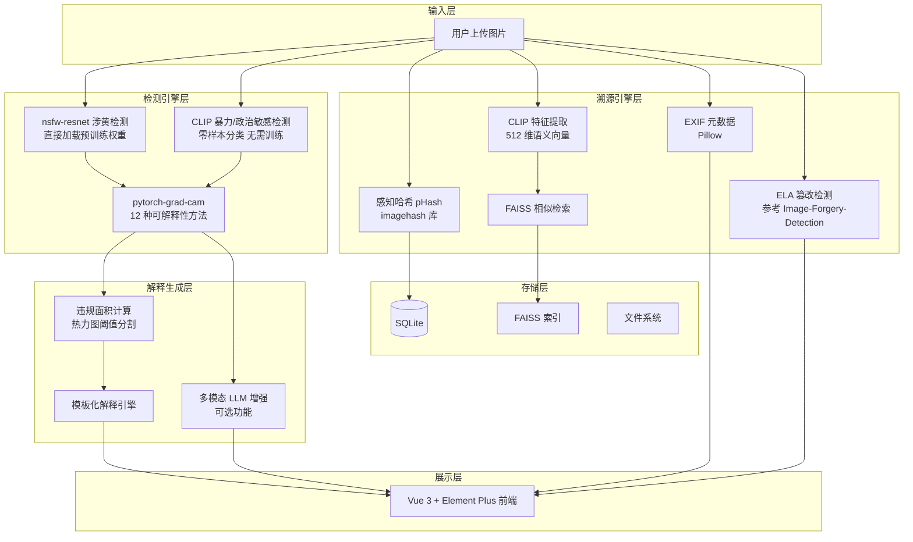
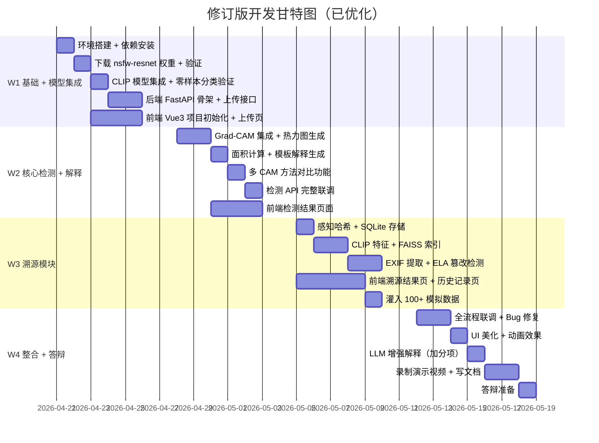

# 修订版实现计划：图像违规内容检测解释与溯源系统

> [!NOTE]
> 本修订版基于对 GitHub 上 **7 个相关开源项目**的深度调研，优化了技术选型和实现路径，**大幅降低了开发难度和训练成本**。

---

## 一、调研的核心开源项目

| 项目 | Stars | 关键发现 | 对我们项目的影响 |
|------|-------|---------|----------------|
| [GantMan/nsfw_model](https://github.com/GantMan/nsfw_model) | 2k | Keras + Inception/MobileNet，5 分类(drawings/hentai/neutral/porn/sexy)，60G+ 数据训练，93% 准确率 | ⭐ **可直接用其数据源和分类体系** |
| [yangbisheng2009/nsfw-resnet](https://github.com/yangbisheng2009/nsfw-resnet) | 400 | **PyTorch + ResNet101**，60 万标注图片训练，线上验证效果良好 | ⭐⭐ **直接复用预训练权重，省去涉黄检测的训练** |
| [jacobgil/pytorch-grad-cam](https://github.com/jacobgil/pytorch-grad-cam) | 12.8k | 支持 **12 种 CAM 方法**（GradCAM/GradCAM++/ScoreCAM/EigenCAM/FinerCAM 等），支持 CNN 和 ViT | ⭐⭐⭐ **核心可解释性工具，直接 pip install** |
| [fcakyon/content-moderation-deep-learning](https://github.com/fcakyon/content-moderation-deep-learning) | 395 | 内容审核领域**最全的论文+工具集合**，涵盖暴力检测、裸露检测、多模态架构、动作识别 | **论文参考 + 数据集索引** |
| [notAI-tech/NudeNet](https://github.com/notAI-tech/NudeNet) | 高 | ONNX 模型，既能分类又能**检测具体身体部位** bbox | **涉黄检测的备用/补充方案** |
| [KulkarniShrinivas/Image-Forgery-Detection](https://github.com/KulkarniShrinivas/Image-Forgery-Detection) | — | ELA + CNN 篡改检测，完整实现 | **ELA 溯源直接参考** |
| [killerzman/Python-ELA](https://github.com/killerzman/Python-ELA) | — | 纯 Python ELA 实现 + GUI | **ELA 算法参考** |

---

## 二、关键调整（与原计划对比）

### 🔄 调整 1：涉黄检测 — 不再从零训练

```diff
- 原计划：自己收集数据 → 训练 ResNet50 → 4 分类
+ 修订版：直接复用 nsfw-resnet 预训练权重 (ResNet101) → 5 分类
```

**理由**：`nsfw-resnet` 已在 60 万张图片上训练完成，PyTorch 原生支持，直接加载权重即可用，省去 3-5 天训练时间。

### 🔄 调整 2：暴力检测 — 使用 CLIP 零样本分类

```diff
- 原计划：收集暴力图片数据集 → 训练暴力分类器
+ 修订版：使用 CLIP 模型 → 零样本分类（无需训练数据）
```

**理由**：暴力内容数据集难获取且标注主观。CLIP 可以用自然语言描述做零样本分类，如：
```python
labels = ["a safe normal photo", "a violent bloody scene", "a photo with weapons"]
```
无需任何训练数据即可工作。

### 🔄 调整 3：Grad-CAM 升级为多方法对比

```diff
- 原计划：只用 GradCAM 一种方法
+ 修订版：同时支持 GradCAM / GradCAM++ / EigenCAM / ScoreCAM
```

**理由**：`pytorch-grad-cam` 库支持 12 种方法，接口统一，只需改一个类名就能切换。做对比实验可以直接加分。

### 🔄 调整 4：增加多模态大模型解释通路

```diff
- 原计划：仅使用模板生成解释文本
+ 修订版：模板 + 可选的多模态 LLM 增强解释
```

**理由**：可调用免费的 Qwen-VL API 或本地 LLaVA 模型，让解释更自然、更详细。作为加分项，不影响核心流程。

---

## 三、修订后的系统架构



---

## 四、修订后的核心模块设计

### 4.1 多引擎违规检测器

```python
class MultiEngineDetector:
    """组合多个检测引擎，覆盖涉黄、涉暴、涉政治"""
    
    def __init__(self):
        # 引擎 1：nsfw-resnet（涉黄）— 直接加载预训练权重
        self.nsfw_model = models.resnet101(pretrained=False)
        self.nsfw_model.fc = nn.Linear(2048, 5)  # 5 类: drawings/hentai/neutral/porn/sexy
        self.nsfw_model.load_state_dict(
            torch.load("models/nsfw_resnet101.pth")  # 从 nsfw-resnet Release 下载
        )
        
        # 引擎 2：CLIP（暴力 + 政治敏感）— 零样本分类
        self.clip_model, self.clip_preprocess = clip.load("ViT-B/32")
        self.violence_labels = [
            "a safe normal photograph",
            "a violent scene with blood or fighting",
            "a scene with weapons like guns or knives",
            "a photo of a political protest or sensitive political content",
            "a photo with political flags or propaganda"
        ]
        self.text_features = self.clip_model.encode_text(
            clip.tokenize(self.violence_labels)
        )
    
    def detect(self, image_path: str) -> DetectionResult:
        # 涉黄检测
        nsfw_result = self._detect_nsfw(image_path)
        
        # 暴力 + 政治敏感检测
        clip_result = self._detect_violence_political(image_path)
        
        # 综合判定：取最严重的违规类型
        return self._merge_results(nsfw_result, clip_result)
    
    def _detect_nsfw(self, image_path):
        """基于 nsfw-resnet 的涉黄检测"""
        img = preprocess(image_path)
        probs = F.softmax(self.nsfw_model(img), dim=1)
        # porn + hentai + sexy 概率之和 > 阈值则判定涉黄
        nsfw_score = probs[0][0] + probs[0][1] + probs[0][4]  # hentai + porn + sexy
        return {"type": "涉黄", "score": nsfw_score.item(), "detail_probs": probs}
    
    def _detect_violence_political(self, image_path):
        """基于 CLIP 的零样本暴力/政治检测"""
        image = self.clip_preprocess(Image.open(image_path)).unsqueeze(0)
        image_features = self.clip_model.encode_image(image)
        similarity = (image_features @ self.text_features.T).softmax(dim=-1)
        
        violence_score = similarity[0][1] + similarity[0][2]  # 暴力 + 武器
        political_score = similarity[0][3] + similarity[0][4]  # 政治
        
        if violence_score > political_score:
            return {"type": "涉暴", "score": violence_score.item()}
        else:
            return {"type": "涉政治敏感", "score": political_score.item()}
```

### 4.2 多方法 Grad-CAM 解释器

```python
from pytorch_grad_cam import (
    GradCAM, GradCAMPlusPlus, EigenCAM, ScoreCAM,
    AblationCAM, XGradCAM, LayerCAM, HiResCAM
)
from pytorch_grad_cam.utils.model_targets import ClassifierOutputTarget
from pytorch_grad_cam.utils.image import show_cam_on_image

class MultiCAMExplainer:
    """支持多种 CAM 方法的可解释性引擎"""
    
    CAM_METHODS = {
        "gradcam": GradCAM,
        "gradcam++": GradCAMPlusPlus,
        "eigencam": EigenCAM,       # 梯度无关，速度最快
        "scorecam": ScoreCAM,       # 效果最好但最慢
        "hirescam": HiResCAM,       # 高分辨率 CAM
    }
    
    def __init__(self, model, target_layer=None):
        self.model = model
        # ResNet: model.layer4[-1]
        self.target_layers = [target_layer or model.layer4[-1]]
    
    def explain(self, image_path, predicted_class, method="gradcam"):
        """生成 CAM 热力图 + 面积计算 + 文字解释"""
        
        img_tensor, rgb_img = load_and_preprocess(image_path)
        
        # 选择 CAM 方法
        CamClass = self.CAM_METHODS[method]
        
        with CamClass(model=self.model, target_layers=self.target_layers) as cam:
            grayscale_cam = cam(
                input_tensor=img_tensor,
                targets=[ClassifierOutputTarget(predicted_class)],
                aug_smooth=True,    # 测试时增强，效果更好
                eigen_smooth=True   # 去噪
            )
        
        cam_image = grayscale_cam[0]
        
        # 计算违规面积占比
        area_ratio = self._calc_area_ratio(cam_image, threshold=0.5)
        
        # 生成叠加图
        visualization = show_cam_on_image(rgb_img, cam_image, use_rgb=True)
        
        return {
            "heatmap": cam_image,
            "visualization": visualization,
            "area_ratio": area_ratio,
            "method": method
        }
    
    def explain_multi_method(self, image_path, predicted_class):
        """用多种方法生成对比结果 — 答辩加分项"""
        results = {}
        for method_name in ["gradcam", "gradcam++", "eigencam"]:
            results[method_name] = self.explain(image_path, predicted_class, method_name)
        return results
    
    def _calc_area_ratio(self, cam, threshold=0.5):
        """计算高激活区域占总面积的百分比"""
        binary_mask = cam > threshold
        return round(binary_mask.sum() / binary_mask.size * 100, 1)
```

### 4.3 解释文本生成器

```python
class ExplanationGenerator:
    """生成人类可读的检测解释"""
    
    TEMPLATES = {
        "涉黄": {
            "high":   "⚠️ 检测到明显的色情/裸露内容，违规区域占图片面积约 {area}%，"
                      "置信度 {conf}%。内容可能涉及裸体、性暗示姿态等元素。建议立即处理。",
            "medium": "⚠️ 检测到疑似低俗内容，违规区域占图片面积约 {area}%，"
                      "置信度 {conf}%。内容可能涉及衣着暴露或性感姿态。建议人工复核。",
            "low":    "ℹ️ 检测到轻微的敏感内容特征（置信度 {conf}%），可能是误判。"
        },
        "涉暴": {
            "high":   "⚠️ 检测到血腥/暴力场景，违规区域占图片面积约 {area}%，"
                      "置信度 {conf}%。涉及内容可能包含流血、肢体冲突或武器等元素。",
            "medium": "⚠️ 检测到疑似暴力内容，违规区域占图片面积约 {area}%，"
                      "置信度 {conf}%。可能包含打斗、争执等场景。建议人工复核。",
            "low":    "ℹ️ 图片存在轻微的暴力特征（置信度 {conf}%），可能是运动或竞技场景。"
        },
        "涉政治敏感": {
            "high":   "⚠️ 检测到政治敏感内容，违规区域占图片面积约 {area}%，"
                      "置信度 {conf}%。可能涉及敏感符号、标语、旗帜或特定人物。",
            "medium": "⚠️ 检测到疑似政治敏感元素（置信度 {conf}%），建议人工复核。",
            "low":    "ℹ️ 检测到轻微的敏感特征（置信度 {conf}%），可能是误判。"
        }
    }
    
    def generate(self, category, confidence, area_ratio):
        # 根据置信度选择模板等级
        if confidence > 80:
            level = "high"
        elif confidence > 50:
            level = "medium"
        else:
            level = "low"
        
        template = self.TEMPLATES.get(category, {}).get(level, "未知违规类型")
        return template.format(
            area=area_ratio,
            conf=round(confidence, 1)
        )
```

### 4.4 ELA 篡改检测（参考开源实现）

```python
class ELAAnalyzer:
    """
    Error Level Analysis 篡改检测
    参考: https://github.com/KulkarniShrinivas/Image-Forgery-Detection
    """
    
    def analyze(self, image_path, quality=90, scale=15):
        original = Image.open(image_path).convert("RGB")
        
        # 步骤 1: 重压缩
        buffer = io.BytesIO()
        original.save(buffer, "JPEG", quality=quality)
        buffer.seek(0)
        recompressed = Image.open(buffer)
        
        # 步骤 2: 计算差值
        ela_image = ImageChops.difference(original, recompressed)
        
        # 步骤 3: 放大差异（增强可视性）
        extrema = ela_image.getextrema()
        max_diff = max([ex[1] for ex in extrema])
        
        if max_diff == 0:
            return {"is_tampered": False, "description": "图片未经压缩或为原始图"}
        
        scale_factor = 255.0 / max_diff * scale
        ela_enhanced = ImageEnhance.Brightness(ela_image).enhance(scale_factor)
        
        # 步骤 4: 分析异常区域
        ela_array = np.array(ela_enhanced.convert("L"))
        anomaly_ratio = (ela_array > 128).sum() / ela_array.size * 100
        
        return {
            "ela_image": ela_enhanced,
            "max_error_level": max_diff,
            "anomaly_ratio": round(anomaly_ratio, 1),
            "is_tampered": anomaly_ratio > 5,  # 异常区域超过 5% 判定篡改
            "description": self._gen_description(anomaly_ratio, max_diff)
        }
    
    def _gen_description(self, anomaly_ratio, max_diff):
        if anomaly_ratio > 20:
            return f"检测到大面积篡改痕迹（异常区域 {anomaly_ratio}%），图片可能经过较大范围的编辑或拼接"
        elif anomaly_ratio > 5:
            return f"检测到局部篡改痕迹（异常区域 {anomaly_ratio}%），图片部分区域可能被修改"
        else:
            return "未检测到明显篡改痕迹，图片可能为原始拍摄"
```

---

## 五、修订后的依赖清单

```txt
# requirements.txt

# Web 框架
fastapi==0.109.0
uvicorn==0.27.0
python-multipart==0.0.9

# 深度学习
torch==2.2.0
torchvision==0.17.0

# 可解释性 (12.8k Stars)
grad-cam==1.5.0

# CLIP 零样本分类
openai-clip==1.0.1
# 或 pip install git+https://github.com/openai/CLIP.git

# 图像处理
Pillow==10.2.0
opencv-python==4.9.0.80
numpy==1.26.4

# 溯源 - 感知哈希
imagehash==4.3.1

# 溯源 - 向量检索
faiss-cpu==1.7.4

# 溯源 - EXIF
exifread==3.0.0

# 数据库
sqlalchemy==2.0.25

# 工具
pydantic==2.5.3
aiofiles==23.2.1
```

---

## 六、修订后的开发排期（4 周）



### 对比原计划的改进

| 环节 | 原计划耗时 | 修订版耗时 | 节省 | 原因 |
|------|-----------|-----------|------|------|
| 数据收集+预处理 | 5 天 | **0 天** | 5 天 | 复用预训练模型 |
| 模型训练 | 3 天 | **0 天** | 3 天 | nsfw-resnet权重 + CLIP零样本 |
| Grad-CAM 集成 | 2 天 | **1 天** | 1 天 | pytorch-grad-cam 一行代码 |
| 总节省 | — | — | **~9 天** | 可用于打磨 UI 和加分项 |

---

## 七、风险应对修订

| 风险 | 原方案 | 修订方案 |
|------|--------|---------|
| 涉黄模型效果差 | 自己训练 | ✅ 直接用 nsfw-resnet 60 万数据训练的成品 |
| 暴力数据不足 | 找 Kaggle 数据集 | ✅ CLIP 零样本，完全不需要数据 |
| 政治敏感更难 | 手动收集 | ✅ CLIP 零样本 + 自定义文本描述 |
| 热力图不好看 | 只用 GradCAM | ✅ 开启 aug_smooth + eigen_smooth + 多方法对比 |
| FAISS 无数据 | — | ✅ 脚本灌入 100+ 模拟图片 + 指纹 |
| 解释太机械 | 固定模板 | ✅ 多级模板 + 可选 LLM 增强 |

---

## 八、答辩亮点清单

| 亮点 | 难度 | 展示效果 | 说明 |
|------|------|---------|------|
| 🔥 多方法 CAM 对比 | 低 | ⭐⭐⭐ | 一张图同时展示 GradCAM/GradCAM++/EigenCAM 三种热力图 |
| 🔥 "检测到血腥场景，占图面积30%" | 低 | ⭐⭐⭐ | 核心交付物，人可读的结构化解释 |
| 🔥 零样本暴力/政治检测 | 中 | ⭐⭐⭐ | 不需要训练数据，体现技术创新性 |
| 🔥 ELA 篡改检测可视化 | 低 | ⭐⭐ | 直观展示图片编辑痕迹 |
| 🔥 FAISS 毫秒级相似图检索 | 中 | ⭐⭐ | 展示溯源能力 |
| ⭐ 多模态 LLM 增强解释 | 中 | ⭐⭐⭐ | 加分项，生成更自然的分析报告 |
| ⭐ 传播链路可视化 | 高 | ⭐⭐ | 可选加分项 |

---

## 九、第一周开始前的准备清单

```
□ 安装 Python 3.10+, Node.js 18+
□ 安装 PyTorch (CPU 版即可: pip install torch torchvision)
□ 下载 nsfw-resnet 预训练权重
  → https://github.com/yangbisheng2009/nsfw-resnet/releases/tag/v1.1
□ 测试 CLIP 是否能正常加载
  → pip install openai-clip && python -c "import clip; clip.load('ViT-B/32')"
□ 测试 pytorch-grad-cam
  → pip install grad-cam && python -c "from pytorch_grad_cam import GradCAM; print('OK')"
□ 创建项目 Git 仓库
□ 用 Vite 初始化 Vue 3 前端项目
```
